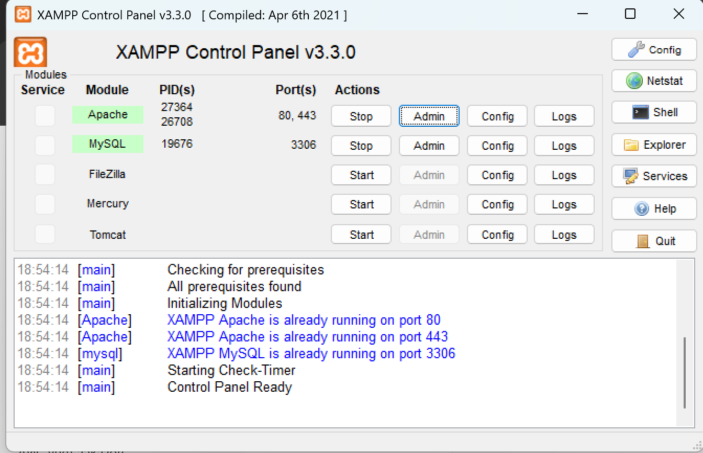
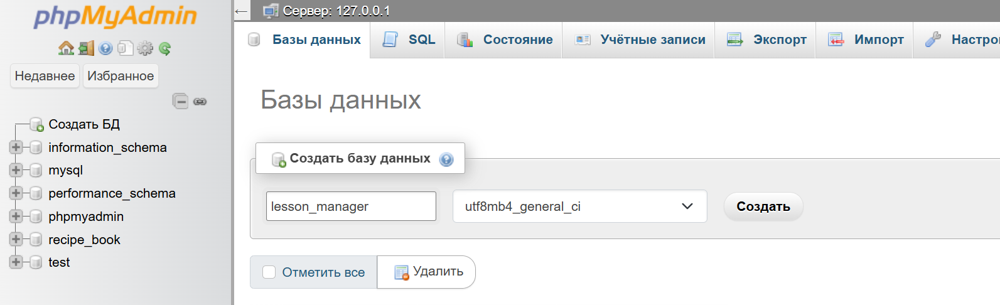
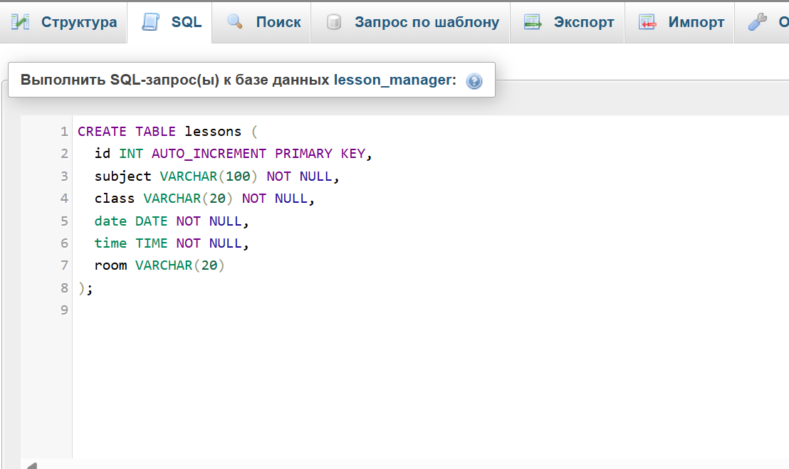

## Создаем бд, используя XAMPP


Перейди в браузере на http://localhost/phpmyadmin.

Нажми "Создать" в левом меню.

Введи имя базы данных, например: lesson_manager



## Шаг 2: Создание таблиц вручную
🔹 Таблица users
sql
Копировать
Редактировать
CREATE TABLE users (
  id INT AUTO_INCREMENT PRIMARY KEY,
  username VARCHAR(50) NOT NULL UNIQUE,
  password VARCHAR(255) NOT NULL,
  role ENUM('admin', 'student') NOT NULL,
  created_at DATETIME DEFAULT CURRENT_TIMESTAMP
);
🔹 Таблица lessons
sql
Копировать
Редактировать
CREATE TABLE lessons (
  id INT AUTO_INCREMENT PRIMARY KEY,
  subject VARCHAR(100) NOT NULL,
  class VARCHAR(20) NOT NULL,
  date DATE NOT NULL,
  time TIME NOT NULL,
  room VARCHAR(20)
);



🔹 Таблица homework
sql
Копировать
Редактировать
CREATE TABLE homework (
  id INT AUTO_INCREMENT PRIMARY KEY,
  lesson_id INT NOT NULL,
  title VARCHAR(100) NOT NULL,
  description TEXT,
  deadline DATE,
  file_path VARCHAR(255),
  FOREIGN KEY (lesson_id) REFERENCES lessons(id) ON DELETE CASCADE
);
🔹 Таблица submissions
sql
Копировать
Редактировать
CREATE TABLE submissions (
  id INT AUTO_INCREMENT PRIMARY KEY,
  homework_id INT NOT NULL,
  student_id INT NOT NULL,
  answer_text TEXT,
  file_path VARCHAR(255),
  submitted_at DATETIME DEFAULT CURRENT_TIMESTAMP,
  grade VARCHAR(10),
  FOREIGN KEY (homework_id) REFERENCES homework(id) ON DELETE CASCADE,
  FOREIGN KEY (student_id) REFERENCES users(id) ON DELETE CASCADE
);
🔹 Таблица announcements
sql
Копировать
Редактировать
CREATE TABLE announcements (
  id INT AUTO_INCREMENT PRIMARY KEY,
  title VARCHAR(100) NOT NULL,
  content TEXT NOT NULL,
  date_posted DATETIME DEFAULT CURRENT_TIMESTAMP
);


## 📁 Структура проекта (в папке htdocs/lessonmanager/):
```
lessonmanager/
├── index.php
├── login.php
├── logout.php
├── dashboard.php         <-- защищённая панель
├── admin/                <-- админ-функции
│   ├── add_user.php
│   ├── manage_homework.php
│   └── ...
├── student/              <-- функции ученика
│   ├── my_homework.php
│   └── ...
├── includes/
│   ├── db.php            <-- подключение к БД
│   ├── auth.php          <-- функции проверки входа
│   └── functions.php     <-- вспомогательные функции
└── assets/
    ├── css/
    └── js/

```
📁 Шаг 1: Перейди в папку htdocs
bash
Копировать код
cd /d C:\xampp\htdocs
(или замени путь, если у тебя XAMPP установлен в другом месте)

📁 Шаг 2: Создай папку проекта
bash
Копировать код
mkdir lessonmanager
cd lessonmanager
📁 Шаг 3: Создай подпапки
bash
Копировать код
mkdir admin student includes assets
mkdir assets\css assets\js
📄 Шаг 4: Создай файлы
bash
Копировать код
type nul > index.php
type nul > login.php
type nul > logout.php
type nul > dashboard.php

type nul > admin\add_user.php
type nul > admin\manage_homework.php

type nul > student\my_homework.php

type nul > includes\db.php
type nul > includes\auth.php
type nul > includes\functions.php

## еще таблицы

 1. Таблицы в БД (если ещё не созданы):
sql
Копировать
Редактировать
CREATE TABLE schedule (
    id INT AUTO_INCREMENT PRIMARY KEY,
    day VARCHAR(20) NOT NULL,
    time VARCHAR(10) NOT NULL,
    subject VARCHAR(100) NOT NULL,
    room VARCHAR(20),
    teacher VARCHAR(100)
);

CREATE TABLE news (
    id INT AUTO_INCREMENT PRIMARY KEY,
    title VARCHAR(255) NOT NULL,
    content TEXT NOT NULL,
    created_at DATETIME DEFAULT CURRENT_TIMESTAMP
);

## Пример данных для расписания и новостей:
sql
Копировать
Редактировать
INSERT INTO schedule (day, time, subject, room, teacher) VALUES
('Понедельник', '09:00', 'Математика', '101', 'Иванова И.И.'),
('Понедельник', '10:00', 'История', '102', 'Петров П.П.');

INSERT INTO news (title, content) VALUES
('Начало четверти', 'С 8 мая начинается новая четверть.'),
('День открытых дверей', 'Приглашаем всех на день открытых дверей 15 мая.');

## Шаг 3: Добавление администратора вручную (через phpMyAdmin)
Открой вкладку SQL и вставь:

INSERT INTO users (username, password, role) VALUES
('admin', MD5('adminpassword'), 'admin');


Теперь у нас есть администратор с логином admin и паролем adminpassword. Администратор может входить в систему и управлять функционалом.