# Индивидуальная работа

## Студентка
Калинкова София, I2302

## Инструкция по запуску

1. Убедиться, что XAMPP установлен и запущен (Apache + MySQL) 
2. Распаковать проект в `C:\xampp\htdocs\lessonmanager`
3. Создать базу данных `lessonmanager` и таблицы через [http://localhost/phpmyadmin](http://localhost/phpmyadmin)
4. Проверить настройки подключения в `includes/db.php`
5. Открыть в браузере:  [http://localhost/lessonmanager/public/](http://localhost/lessonmanager/public/)

## Для чего данное приложение?

**LessonManager** — это система для управления учебным процессом в начальной школе.
- Учителя создают задания и ставят оценки.
- Ученики выполняют задания и отправляют ответы.

Простой инструмент для удобного отслеживания учебных успехов.

## Структура и поверхностное описание

```
lessonmanager/
│
├── admin/                       # Интерфейс администратора (учителя)
│   ├── add_user.php             # Добавление ученика
│   ├── check_homework.php       # Проверка домашних заданий
│   ├── index.php                # Главная страница администратора
│   ├── manage_homework.php      # Управление заданиями
│   └── img/                     # Изображения для админки
│
├── includes/                    # Общие подключения
│   ├── auth.php                 # Проверка авторизации
│   ├── db.php                   # Подключение к базе
│   └── layout.php               # Единый шаблон оформления
│
├── public/                      # Общедоступные страницы
│   ├── assets/                  # Стили, изображения и т.д.
│   ├── dashboard.php            # Редирект в зависимости от роли
│   ├── forgot_password.php      # Форма "забыли пароль"
│   ├── index.php                # Точка входа
│   ├── login.php                # Вход в систему
│   ├── logout.php               # Выход
│   ├── reset_password.php       # Сброс пароля по токену
│   └── send_reset.php           # Отправка письма сброса
│
├── student/                     # Интерфейс ученика
│   └── my_homework.php          # Просмотр и отправка домашки
│
└── README.md                    # Отчет :|

```

## Функционал приложения


1. **Аутентификация пользователей**

   - Механизм регистрации и входа в систему.

 Так как данное приложение предназначено для работы с детьми регистрацию будет проводить админ, то есть учитель, после чего логин и пароль могуть быть предоставлены ученику или его родителям


   - После успешной аутентификации пользователю предоставляется доступ к защищённым разделам сайта.

   В зависимости он роли пользователя открывается новый функционал, например админ может создавать новых пользователей с разными ролями!, добавлять и проверять задание,выставлять оценку, а студент добавлять ответ на задание

   - Данные аутентификации, а именно пароль храниться безопасным образом с использованием хеширования в базе данных.
   - Реализован механизм восстановления пароля (через электронную почту).

2. **Общедоступный компонент**

   - Раздел приложения, доступный всем пользователям без необходимости авторизации.
    назовем это главной страницей

   Это рассписание класса, какие-то объявления и информация про учителей

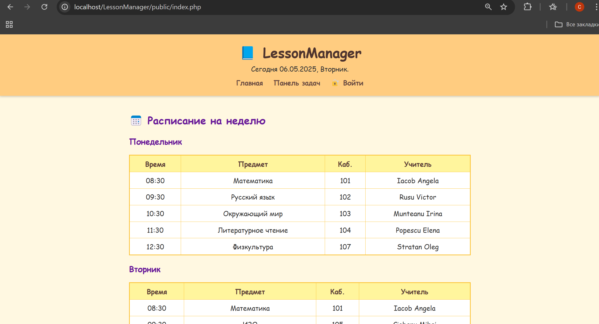
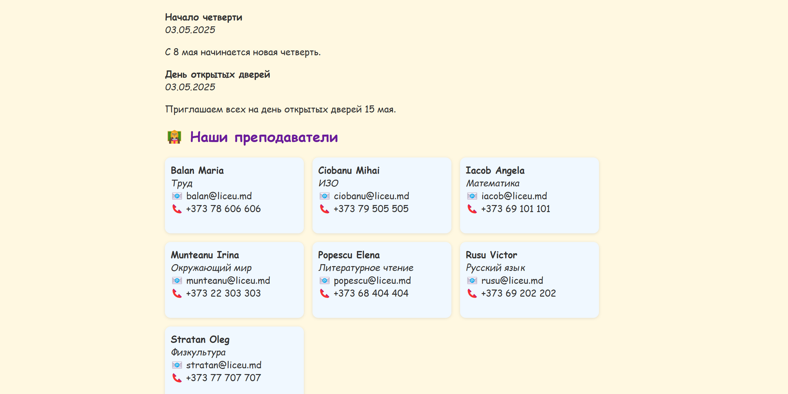
   Также отображается дата и день недели, вход и панель задач, но она не доступна без авторизации
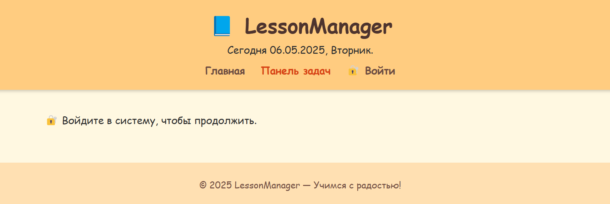

3. **Вход в систему**

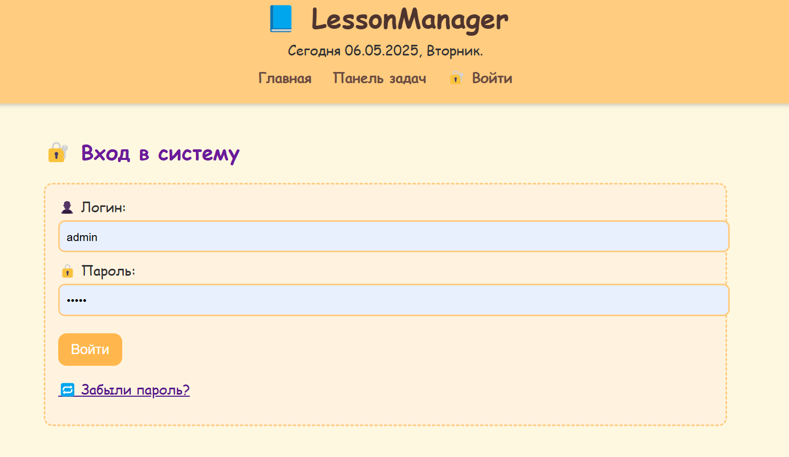

Пользователь вводит свой логин и пароль для входа в систему. Если он забыл пароль, он может воспользоваться функцией восстановления, перейдя по ссылке "Забыли пароль?". После этого ему нужно ввести свой email, и система отправит ссылку для сброса пароля. С помощью этой ссылки пользователь сможет создать новый пароль для доступа к системе.

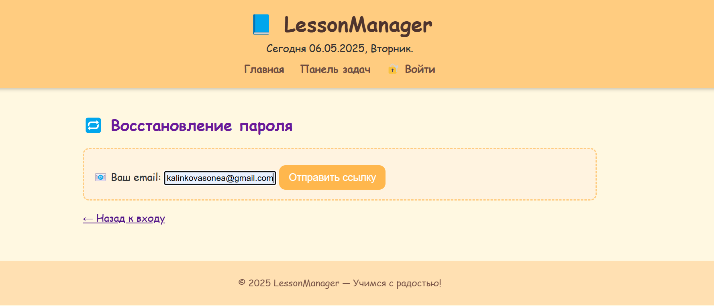
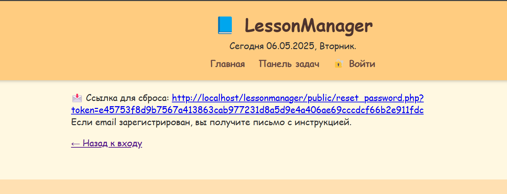


3. **Формы взаимодействия с пользователем**  

   - **Форма создания ресурса**  
     форма доступная админестратору для создания нового пользователя 
     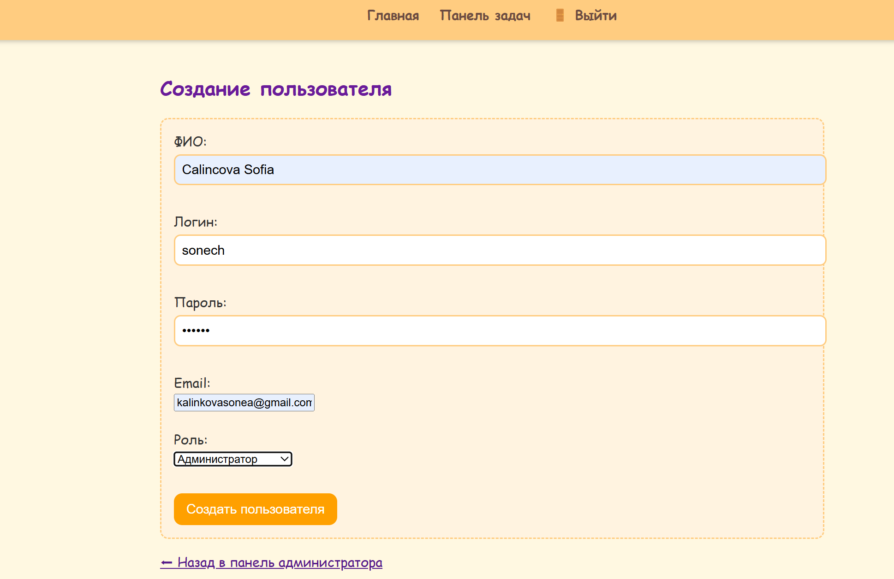
     содержит 5 полей для заполнения, данные валидируются
     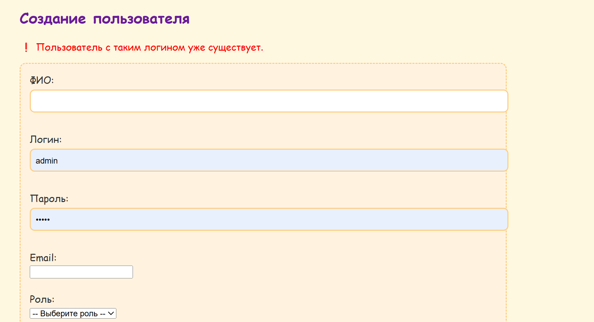

```php
<form method="post">
    <label>ФИО:<br>
        <input type="text" name="full_name" required>
    </label><br><br>

    <label>Логин:<br>
        <input type="text" name="username" required>
    </label><br><br>

    <label>Пароль:<br>
        <input type="password" name="password" required>
    </label><br><br>

    <label>Email:<br>
        <input type="email" name="email" required>
    </label><br><br>

    <label>Роль:<br>
        <select name="role" required>
            <option value="">-- Выберите роль --</option>
            <option value="admin">Администратор</option>
            <option value="student">Ученик</option>
        </select>
    </label><br><br>

    <button type="submit">Создать пользователя</button>
</form>
```
```php
if (empty($full_name) || empty($username) || empty($password) || empty($role) || empty($email)) {
        $error = "❗ Пожалуйста, заполните все поля.";
    } elseif (!preg_match('/^[a-zA-Z0-9_]{3,20}$/', $username)) {
        $error = "❗ Логин должен содержать только буквы, цифры и подчёркивания (3-20 символов).";
    } elseif (!in_array($role, ['admin', 'student'])) {
        $error = "❗ Недопустимая роль пользователя.";
    } elseif (!filter_var($email, FILTER_VALIDATE_EMAIL)) {
        $error = "❗ Неверный формат email.";
    } else {
        $hashedPassword = password_hash($password, PASSWORD_DEFAULT);

        try {
            $stmt = $pdo->prepare("INSERT INTO users (full_name, username, password, role, email) VALUES (?, ?, ?, ?, ?)");
            $stmt->execute([
                htmlspecialchars($full_name),
                htmlspecialchars($username),
                $hashedPassword,
                $role,
                htmlspecialchars($email)
            ]);
            $success = "✅ Пользователь успешно добавлен.";
        } catch (PDOException $e) {
            $error = $e->getCode() == 23000
                ? "❗ Пользователь с таким логином уже существует."
                : "❗ Ошибка: " . $e->getMessage();
        }
    }
```
   - **Форма поиска**  
     Позволяет находить учителю находить выполненные задания конкретным учеником (поиск по имени).

     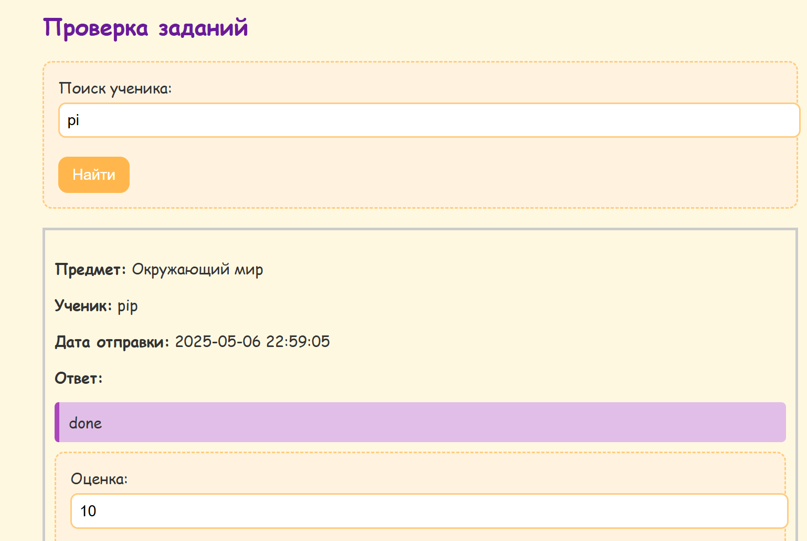

  ```php
  <form method="get" style="margin-bottom: 20px;">
    <label for="search">Поиск ученика:</label>
    <input type="text" name="search" id="search" value="<?= htmlspecialchars($search, ENT_QUOTES) ?>" placeholder="Введите имя ученика">
    <button type="submit">Найти</button>
  </form>
  ```

4. **Защищённый компонент (только для авторизованных пользователей)**

После входа в систему пользователь *ученик* видит свои задания, на которые ему предстоить ответить или уже ответил и видит оценку, также он может перейти на главную, та страница которя доступна и для не авторизированных пользователей, или выйти
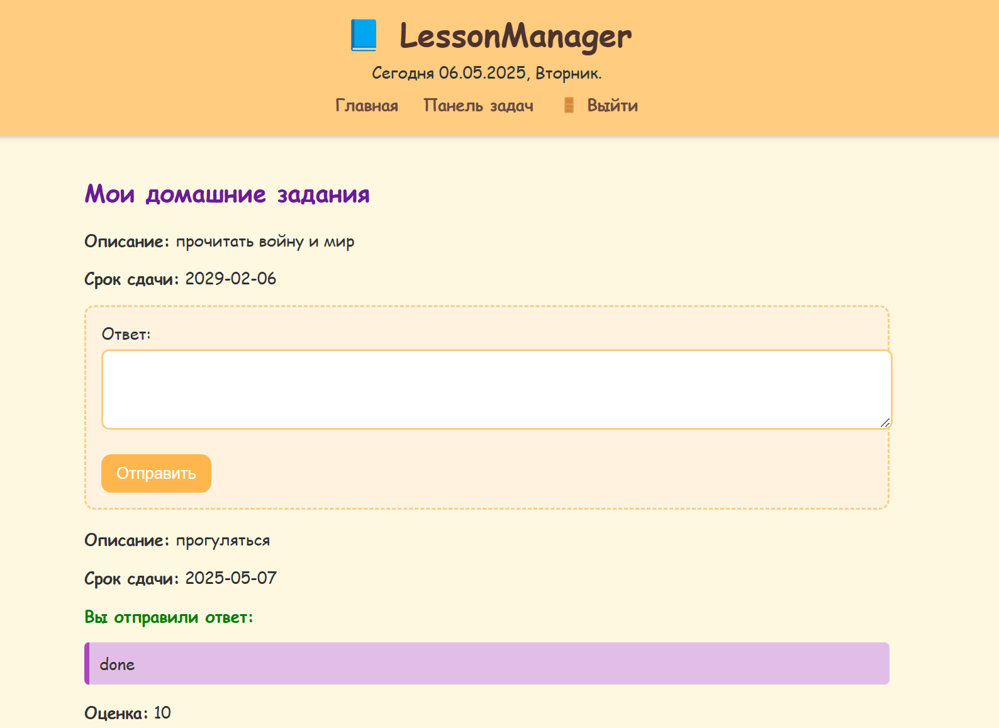

Для *админа* доступны опции добавления пользователя, добавления и проверки задания.
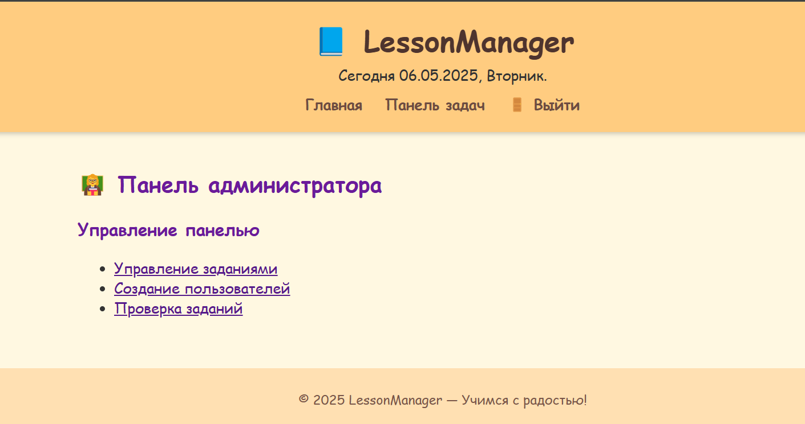
добавление пользователя и задания являются формами
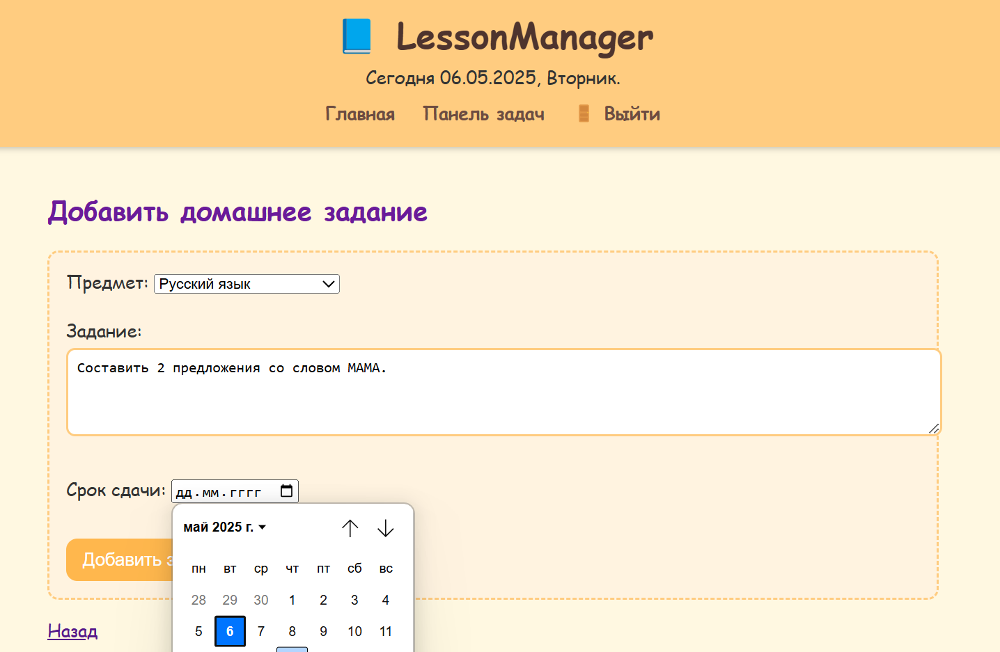

```php
<form method="POST" action="">
    <label>Предмет:</label>
    <select name="subject" required>
        <option value="">-- Выберите предмет --</option>
        <option value="Математика">Математика</option>
        <option value="Русский язык">Русский язык</option>
        <option value="Окружающий мир">Окружающий мир</option>
        <option value="Литературное чтение">Литературное чтение</option>
        <option value="ИЗО">ИЗО</option>
        <option value="Технология">Технология</option>
        <option value="Физкультура">Физкультура</option>
    </select><br><br>

    <label>Задание:</label><br>
    <textarea name="description" rows="4" cols="50" required></textarea><br><br>

    <label>Срок сдачи:</label>
    <input type="date" name="due_date" required><br><br>

    <input type="submit" name="submit" value="Добавить задание">
</form>
```

```php
if ($_SERVER['REQUEST_METHOD'] === 'POST' && isset($_POST['submit'])) {
    $subject = $_POST['subject'];
    $description = $_POST['description'];
    $due_date = $_POST['due_date'];

    // Валидация обязательных полей
    if (empty($subject) || empty($description) || empty($due_date)) {
        $error = "Пожалуйста, заполните все поля.";
    } else {
        // Подготовка и выполнение SQL-запроса для добавления задания
        $stmt = $pdo->prepare("INSERT INTO homework (subject, description, due_date) VALUES (?, ?, ?)");
        $stmt->execute([$subject, $description, $due_date]);
        $success = "Домашнее задание добавлено!";
    }
}
```

## Вывод
Работа над этим приложением позволила получить опыт в разработке веб-приложения с авторизацией, управлением пользователями и безопасным восстановлением пароля. В процессе были закреплены навыки работы с PHP, MySQL, HTML/CSS, а также освоены основы локальной разработки с использованием XAMPP.

В результате создано простое и удобное приложение — LessonManager, разработанное специально для начальной школы. Оно помогает учителю (администратору) легко управлять учебным процессом: добавлять учеников, выдавать задания и выставлять оценки. Ученики, в свою очередь, могут просматривать задания, отправлять ответы и получать обратную связь. При необходимости они могут восстановить доступ через простую форму сброса пароля.

LessonManager можно быстро развернуть на локальном компьютере с помощью XAMPP, без сложных настроек. Интерфейс яркий, понятный и подходит даже для пользователей без технической подготовки.


