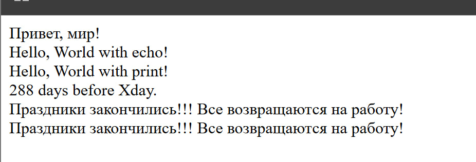

# Лабораторная работа №1
- Калинкова София, I2302

## Цель:

Целью данной лабораторной работы является установка и настройка среды разработки для работы с языком программирования PHP, а также создание первой программы на PHP.


## Шаг 1. Установка PHP
(вариант с встроенным веб-сервером PHP)

Следуя инструкции, я выполняю установку PHP на свое устройство:
1. Перехожу на официальный сайт PHP.  
2. Скачиваю актуальную версию PHP для моей операционной системы.
3. Распаковываю архив в удобное для меня мест (C:\Program Files\PHP).
5. В "Переменные среды" (Path) добавляю путь к папке PHP.
6. Проверяю установку, выполнив в командной строке: `php -v`.

## Шаг 2. Написание первой PHP-программы 

Создаю директорию для проекта:  
1. C:\Users\kalin\Desktop\PHP\php_lab01.
2. Создаю файл index.php и откройте его в текстовом редакторе (у меня VS Code).
3. Вставляю следующий код:
```php
<?php

echo "Привет, мир!";
```

 4. Запускаю с помощью встроенного веб-сервера PHP командай (`php -S localhost:8080`).

 ## Шаг 4.

Выведите строку "Hello, World!" используя функцию echo и print.
```php
echo "Hello, World with echo!";
print "Hello, World with print!";
```
 ## Шаг 5.

1. Создаю две переменные:
$days = 288;
$message = "Все возвращаются на работу!";

2. Вывожу значения переменных на экран несколькими способами:

2.1 С использование конкатенации:
`echo $days . " days before Xday.<br>";`

 2.2 С использованием двойных кавычек (интерполяции)
 ```php
echo "Праздники закончились!!! {$message}<br>";
echo "Праздники закончились!!! $message<br>";
```

3. Используйте переход на новую строку в выводе используя тэг <br>, так как браузер игнорирует обычные переносы строк (\n)

### Вывод программы с сервера


## Контрольные вопросы
**1. Какие способы установки PHP существуют?**

- Ручная установка с официального сайта PHP.
- Установка через XAMPP.

**2. Как проверить, что PHP установлен?**

- Выполнить команду php -v.
- Запустить phpinfo(); в браузере.

**3. Чем отличается оператор echo от print?**  
`echo` быстрее и поддерживает несколько аргументов, а `print` медленнее, всегда возвращает 1 и принимает только один аргумент.

## Библиография
Документация PHP: https://www.php.net/docs.php
Руководство по установке PHP: https://www.php.net/manual/ru/install.php
Официальный сайт XAMPP: https://www.apachefriends.org
Основы PHP: https://www.w3schools.com/php/
Переменные и вывод в PHP: https://www.php.net/manual/ru/language.variables.php

## Вывод

В этой лабораторной работе была выполнена установка и настройка PHP, а также написана первая программа. Изучены способы запуска встроенного веб-сервера, вывод текста с помощью echo и print, работа с переменными и правильное оформление переноса строк в HTML. В итоге код успешно отобразился в браузере, что подтверждает корректную настройку окружения.
