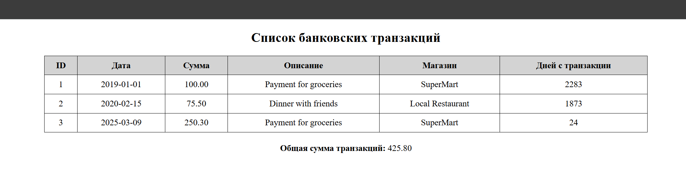
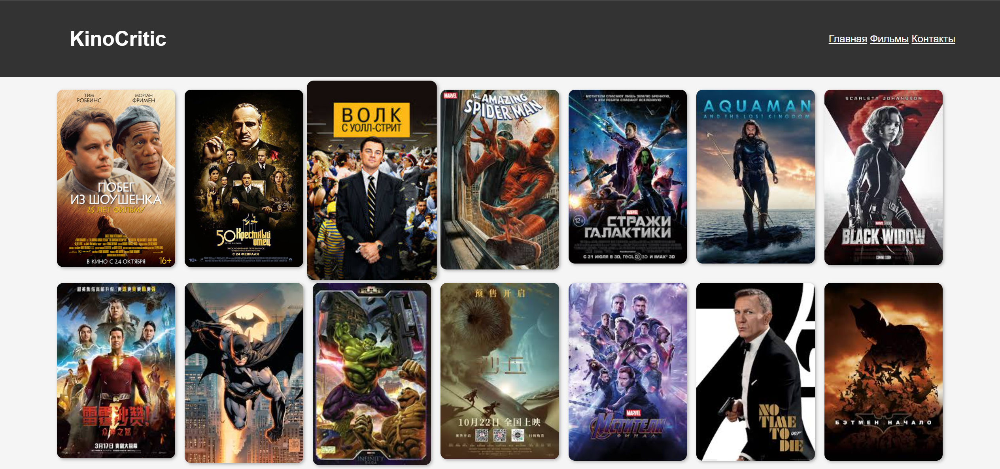

# Лабораторная работа №3. Массивы и Функции

## Цель работы

Освоить работу с массивами в PHP, применяя различные операции: создание, добавление, удаление, сортировка и поиск. Закрепить навыки работы с функциями, включая передачу аргументов, возвращаемые значения и анонимные функции.

## Условие

### Задание 1. Работа с массивами

Разработать систему управления банковскими транзакциями с возможностью:

- добавления новых транзакций;
- удаления транзакций;
- сортировки транзакций по дате или сумме;
- поиска транзакций по описанию.

#### Задание 1.1. Подготовка среды

1. Установлен PHP 8+.
3. В начале файла включаю строгую типизацию:

   ```php
   <?php

   declare(strict_types=1);
   ```

#### Задание 1.2. Создание массива транзакций

Создаю массив `$transactions`, содержащий информацию о банковских транзакциях. Каждая транзакция представлена в виде ассоциативного массива с полями:

- `id` – уникальный идентификатор транзакции;
- `date` – дата совершения транзакции (YYYY-MM-DD);
- `amount` – сумма транзакции;
- `description` – описание назначения платежа;
- `merchant` – название организации, получившей платеж.


```php
$transactions = [
    [
        "id" => 1,
        "date" => "2019-01-01",
        "amount" => 100.00,
        "description" => "Payment for groceries",
        "merchant" => "SuperMart",
    ],
    [
        "id" => 2,
        "date" => "2020-02-15",
        "amount" => 75.50,
        "description" => "Dinner with friends",
        "merchant" => "Local Restaurant",
    ],
    [
        "id" => 3,
        "date" => "2025-03-09",
        "amount" => 250.30,
        "description" => "Payment for groceries",
        "merchant" => "SuperMart",
    ],
];
```

#### Задание 1.3. Вывод списка транзакций

1. Использую `foreach`, чтобы вывести список транзакций в HTML-таблице.

```php
            <?php foreach ($transactions as $transaction): ?>
                <tr>
                    <td><?= $transaction['id'] ?></td>
                    <td><?= $transaction['date'] ?></td>
                    <td><?= number_format($transaction['amount'], 2) ?></td>
                    <td><?= $transaction['description'] ?></td>
                    <td><?= $transaction['merchant'] ?></td>
                    <td><?= daysSinceTransaction($transaction['date']) ?></td>
                </tr>
            <?php endforeach; ?>
```

#### Задание 1.4. Реализация функций

Создание и используйте следующие функции:

1. Создаю функцию `calculateTotalAmount(array $transactions): float`, которая вычисляет общую сумму всех транзакций.

```php
/**
 * Вычисляет общую сумму всех транзакций.
 *
 * @param array $transactions
 * @return float
 */
function calculateTotalAmount(array $transactions): float {
    return array_sum(array_column($transactions, 'amount'));
}
```

2. Создаю функцию `findTransactionByDescription(string $descriptionPart)`, которая ищет транзакцию по части описания.

```php
/**
 * Ищет транзакцию по части описания.
 *
 * @param string $descriptionPart
 * @return array
 */
function findTransactionByDescription(string $descriptionPart): array {
    global $transactions;
    return array_filter($transactions, function ($transaction) use ($descriptionPart) {
        return stripos($transaction['description'], $descriptionPart) !== false;
    });
}
```
3. Создаю функцию `findTransactionById(int $id)`, которая ищет транзакцию по идентификатору.

```php
/**
 * Ищет транзакцию по идентификатору.
 *
 * @param int $id
 * @return array|null
 */
function findTransactionById(int $id): ?array {
    global $transactions;
    $result = array_filter($transactions, fn($transaction) => $transaction['id'] === $id);
    return reset($result) ?: null;
}
```
4. Создаю функцию `daysSinceTransaction(string $date): int`, которая возвращает количество дней между датой транзакции и текущим днем.

```php
/**
 * Вычисляет количество дней с момента транзакции.
 *
 * @param string $date
 * @return int
 */
function daysSinceTransaction(string $date): int {
    $transactionDate = new DateTime($date);
    $currentDate = new DateTime();
    return $transactionDate->diff($currentDate)->days;
}
```
5. Создаю функцию `addTransaction(int $id, string $date, float $amount, string $description, string $merchant): void` для добавления новой транзакции.

```php
/**
 * Добавляет новую транзакцию в массив.
 *
 * @param int $id
 * @param string $date
 * @param float $amount
 * @param string $description
 * @param string $merchant
 */
function addTransaction(int $id, string $date, float $amount, string $description, string $merchant): void {
    global $transactions;
    $transactions[] = [
        'id' => $id,
        'date' => $date,
        'amount' => $amount,
        'description' => $description,
        'merchant' => $merchant,
    ];
}
```

#### Задание 1.5. Сортировка транзакций

1. Сортировка по дате с использованием `usort()`.

```php
/**
 * Сортирует транзакции по дате.
 *
 * @param array $transactions
 * @return void
 */
function sortTransactionsByDate(array &$transactions): void {
    usort($transactions, function ($a, $b) {
        return strtotime($a['date']) <=> strtotime($b['date']);
    });
}
```

2. Сортировка транзакции по сумме (по убыванию).
```php
/**
 * Сортирует транзакции по сумме (по убыванию).
 *
 * @param array $transactions
 * @return void
 */
function sortTransactionsByAmount(array &$transactions): void {
    usort($transactions, function ($a, $b) {
        return $b['amount'] <=> $a['amount'];
    });
}
```
**Результат**:



### Задание 2. Работа с файловой системой

1. Создаю директорию `"image"`, в которой сохраните не менее 20-30 изображений с расширением .jpg.
2. Затем создаю файл `index.php`, в котором определите веб-страницу с хедером, меню, контентом и футером.
3. Вывожу изображения из директории `"image"` на веб-страницу в виде галереи.

   **Пример скрипта**:

   ```php
   <?php
/**
 * Сканирует директорию для поиска изображений и отображает их в галерее.
 *
 * В случае ошибки открытия директории выводится сообщение об ошибке.
 *
 * @var string $dir Путь к директории с изображениями.
 * @var array|false $files Массив файлов в директории или false в случае ошибки.
 */
$dir = 'image/';
$files = scandir($dir);


В этой части кода мы указываем путь к директории с изображениями ($dir = 'image/') и используем функцию scandir() для получения списка всех файлов в этой директории. Если директорию открыть не удалось, выводится сообщение об ошибке.

/**
 * Проверка на успешное открытие директории.
 */
if ($files === false) {
    echo "<p>Ошибка: не удалось открыть директорию</p>";
    return;
}
?>
   ```
В этой части кода мы перебираем все файлы, которые были найдены в директории. Мы исключаем специальные файлы "." и "..", которые представляют собой ссылки на текущую и родительскую директорию. Для каждого файла выводится изображение в виде карточки. Путь к каждому изображению формируется с помощью переменной $path, и изображения отображаются на странице с помощью HTML-кода.

```php

<?php
            /**
             * Проходит по всем файлам в директории и выводит изображения в виде карточек.
             *
             * @var int $i Индекс текущего файла.
             * @var string $path Путь к изображению.
             */
            for ($i = 0; $i < count($files); $i++) {
                if ($files[$i] != "." && $files[$i] != "..") {
                    $path = $dir . $files[$i];
                    echo "<div class='card'></div>";
                }
            }
            ?>
```

**Результат**:




## Контрольные вопросы

**1. Что такое массивы в PHP?**

   Массивы в PHP — это переменные, которые могут хранить несколько значений. Они позволяют организовать данные в виде коллекции.
   
**2. Каким образом можно создать массив в PHP?**

Массив можно создать с помощью функции `array()`, например:

   ```php
   $arr = array(1, 2, 3);
   ```

Или с использованием краткой записи:

   ```php
   $arr = [1, 2, 3];
```

**3. Для чего используется цикл `foreach`?**

Цикл `foreach` используется для перебора элементов массива. Он позволяет работать с каждым элементом массива без необходимости вручную отслеживать индекс.


## Вывод

В рамках лабораторной работы была реализована система управления банковскими транзакциями. Создан массив $transactions, в котором хранятся данные о транзакциях с полями id, date, amount, description и merchant. Были реализованы следующие функции для вычисления общей суммы всех транзакций, поиск транзакции по части описания или по идентофткатору, вычисление количества дней с момента транзакции, добавление новой транзакцию в массив. Также были реализованы функции сортировки транзакций по дате и по сумме с использованием usort().

 Вторая часть лабораторной работы была посвящена работе с файловой системой. Создана директория "image", в которой хранятся изображения. С помощью PHP-скрипта изображения были выведены на веб-страницу в виде галереи. Для этого использовалась функция scandir(), которая сканирует директорию и возвращает список файлов, а затем изображения выводятся с помощью HTML-тегов.


## Библиография

1. Официальная документация PHP: [https://www.php.net/manual/ru/](https://www.php.net/manual/ru/function.usort.php)
2. Работа с массивами в PHP: [https://www.php.net/manual/ru/language.types.array.php](https://www.php.net/manual/ru/language.types.array.php)
