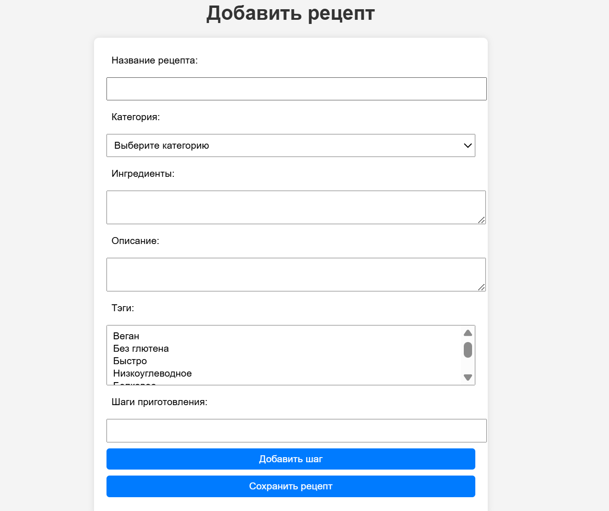
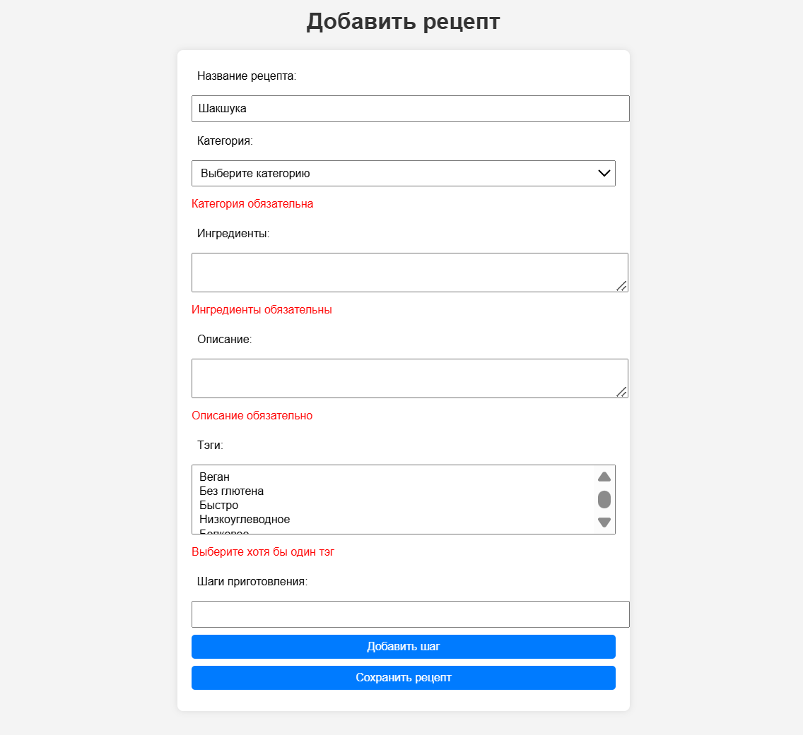
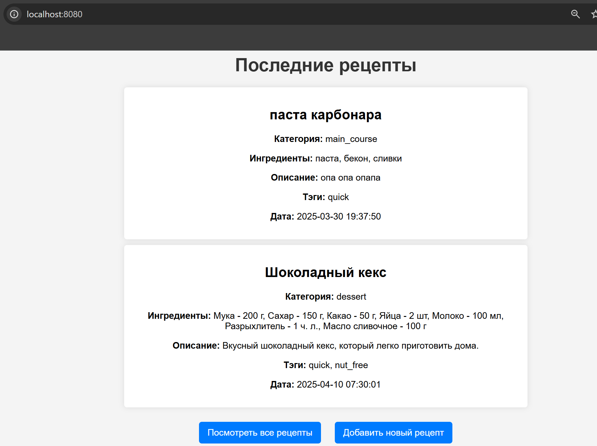
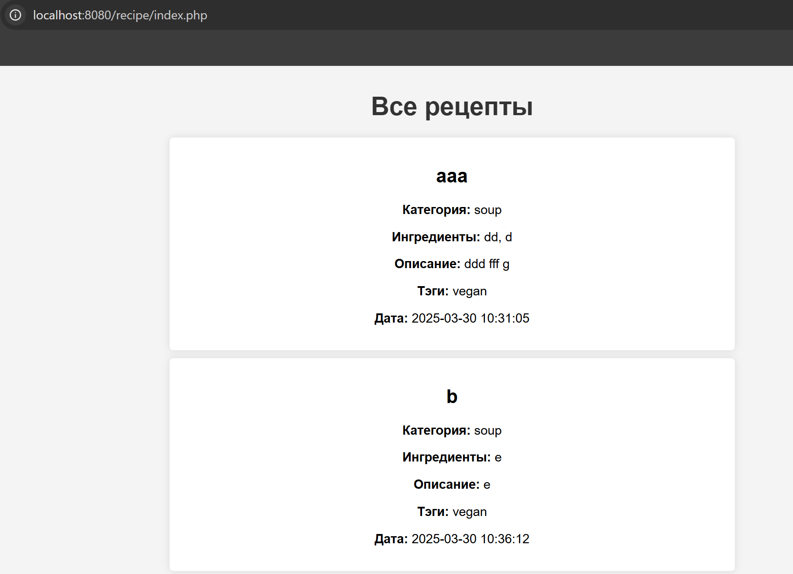
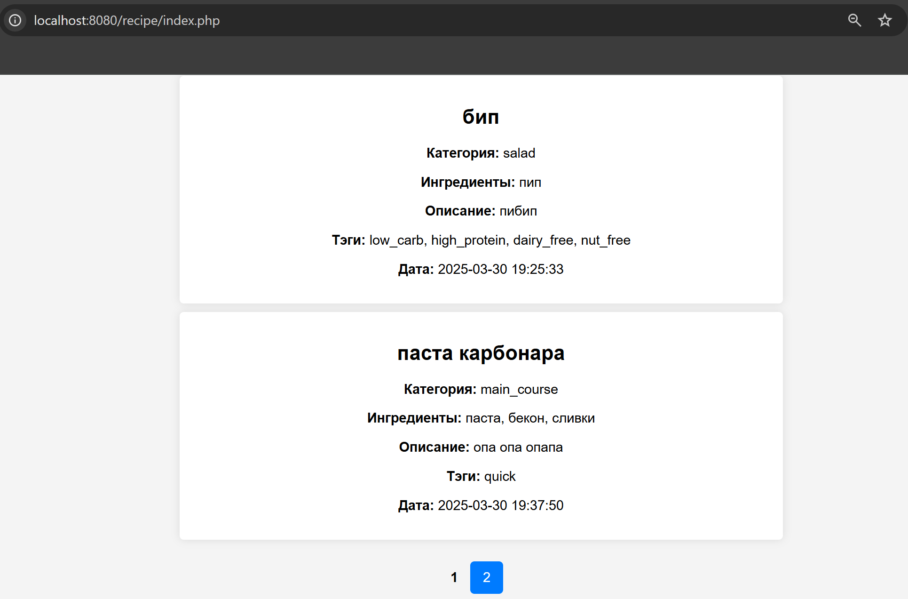

# Лабораторная работа №4. Обработка и валидация форм

## Цель работы

Освоить основные принципы работы с HTML-формами в PHP, включая отправку данных на сервер и их обработку, включая валидацию данных.

## Тема проекта:

 *Каталог рецептов*.

### Задание 1. Создание проекта

1. Создаю корневую директорию проекта `recipe-book`.
2. Создаю файловую структуру проекта:
   ```
   recipe-book/
   ├── public/                        
   │   ├── index.php                   # Главная страница (вывод последних рецептов)
   │   └── recipe/                    
   │       ├── create.php              # Форма добавления рецепта
   │       └── index.php               # Страница с отображением рецептов
   ├── src/                            
   │   ├── handlers/                   # Обработчики форм
   │   └── helpers.php                 # Вспомогательные функции для обработки данных
   ├── storage/                        
   │   └── recipes.txt                 # Файл для хранения рецептов
   └── README.md                       # Описание проекта
   ```


### Задание 2. Создание формы добавления рецепта

1. Создаю HTML-форму для добавления рецепта.

```php
<form action="" method="POST">
```

2. Форма содержит следующие поля:
   - Название рецепта
    (`<input type="text" name="title" id="title" value="<?= htmlspecialchars($_POST['title'] ?? '') ?>">`);
   - Категория рецепта 
   ```php
    <select name="category" id="category">
        <option value="">Выберите категорию</option>
        <option value="soup" ...>Супы</option>
        ...
    </select>
    ```
   - Ингредиенты 
   (`<textarea name="ingredients" id="ingredients"><?= htmlspecialchars($_POST['ingredients'] ?? '') ?></textarea> `);

   - Описание рецепта 
   (`<textarea name="description" id="description"><?= htmlspecialchars($_POST['description'] ?? '') ?></textarea>`);

   - Тэги выпадающий список с возможностью выбора нескольких значений, 
   ```php
   <select name="tags[]" id="tags" multiple>
    <option value="vegan">Веган</option>
    ...
    </select>
    ```

3. Добавление поле для **шагов приготовления рецепта**:
     динамическое добавление шагов с помощью JavaScript (кнопка "Добавить шаг"), где каждый шаг — отдельное поле ввода.

     ```php
     <div id="steps">
        <div>
            <input type="text" name="steps[]" value="">
        </div>
    </div>
    <button type="button" id="addStep">Добавить шаг</button>
     ```

     ```js
     document.getElementById('addStep').addEventListener('click', function() {
        let stepsDiv = document.getElementById('steps');
        let newStep = document.createElement('div');
        newStep.innerHTML = '<input type="text" name="steps[]" value="">';
        stepsDiv.appendChild(newStep);
    });
     ```

4. Добавление кнопки **"Отправить"** для отправки формы.

`<button type="submit">Сохранить рецепт</button><button type="submit">Сохранить рецепт</button>`



### Задание 3. Обработка формы

1. Создаю в директории `handlers` файл, который будет обрабатывать данные формы.

2. В обработчике реализована:
   - Фильрация данных;
   ```php
    $title = $data['title'] ?? '';
    $category = $data['category'] ?? '';
    $ingredients = $data['ingredients'] ?? '';
    $description = $data['description'] ?? '';
    $tags = $data['tags'] ?? [];
    $steps = $data['steps'] ?? [];
   ```
   - Валидация данных;

   `$errors = validateRecipe($title, $category, $ingredients, $description, $tags, $steps);`

   - Сохраняю данных в файл `storage/recipes.txt` в формате JSON.

   ```php
    if (empty($errors)) {
        saveRecipe($title, $category, $ingredients, $description, $tags, $steps);
        return ['success' => true];
    }
    ```

3. Также нужны вспомогательные функции, чтобы не было дублирования кода. Они в файле `src/helpers.php`.
    ```php
    /**
    * Сохраняет рецепт в файл.
    * 
    * Преобразует данные рецепта в формат JSON и добавляет их в файл.
    * Все данные (теги, шаги, ингредиенты и описание) проходят очистку через htmlspecialchars
    * для предотвращения XSS-атак.
    *
    * @param string $title Название рецепта.
    * @param string $category Категория рецепта.
    * @param string $ingredients Ингредиенты рецепта.
    * @param string $description Описание рецепта.
    * @param array $tags Массив тегов, связанных с рецептом.
    * @param array $steps Массив шагов приготовления рецепта.
    * 
    * @return void
    */
    function saveRecipe(...) {
    ...
    file_put_contents(__DIR__ . '/../storage/recipes.txt', json_encode($recipe, JSON_UNESCAPED_UNICODE) . PHP_EOL, FILE_APPEND);
    }
    ```
    
```php
<?php

/**
 * Загружает все рецепты из файла.
 * 
 * Читает файл с рецептами и преобразует каждую строку (JSON) в ассоциативный массив.
 *
 * @return array Массив рецептов (каждый рецепт — ассоциативный массив).
 */
function loadRecipes() {
    $file = __DIR__ . '/../storage/recipes.txt';
    if (!file_exists($file)) {
        return [];
    }
    $recipes = file($file, FILE_IGNORE_NEW_LINES | FILE_SKIP_EMPTY_LINES);
    return array_map(fn($line) => json_decode($line, true), $recipes);
}
```

4. После успешного сохранения данных выполняется перенаправление пользователя на главную страницу.

```php
if (isset($result['success']) && $result['success'] === true) {
    header('Location: /');
    exit;
}
```
5. Если валидация не пройдена, отображается соответствующие ошибки на странице добавления рецепта под соответствующими полями.

```php
<?php if (isset($errors['title'])): ?>
    <p style="color:red"><?= $errors['title'] ?></p>
<?php endif; ?>
```

   

### Задание 4. Отображение рецептов

1. В файле `public/index.php` отображаются 2 последних рецепта из `storage/recipes.txt`:

   ```php
   // Читаем данные из файла
   $recipes = file(__DIR__ . '/../storage/recipes.txt', FILE_IGNORE_NEW_LINES);

   // Преобразуем строки JSON в массив
   $recipes = array_map('json_decode', $recipes);

   // Получаем два последних рецепта
   $latestRecipes = array_slice($recipes, -2);
   ```

   


2. В файле `public/recipe/index.php` отображаются все рецепты из файла `storage/recipes.txt`.

```php
$recipes = file(__DIR__ . '/../../storage/recipes.txt', FILE_IGNORE_NEW_LINES);
$recipes = array_map('json_decode', $recipes, true);
```


### Дополнительное задание

1. Реализация пагинации (постраничный вывод) списка рецептов.
2. На странице `public/recipe/index.php` отображайте по 5 рецептов на страницу.
```php
$page = isset($_GET['page']) ? (int) $_GET['page'] : 1;
$recipesPerPage = 5;
$totalRecipes = count($recipes);
$totalPages = ceil($totalRecipes / $recipesPerPage);
$offset = ($page - 1) * $recipesPerPage;
$recipes = array_slice($recipes, $offset, $recipesPerPage);
```

```php
<?php for ($i = 1; $i <= $totalPages; $i++): ?>
    <a href="?page=<?= $i ?>"><?= $i ?></a>
<?php endfor; ?>
```


## Контрольные вопросы

1. Какие методы HTTP применяются для отправки данных формы?

- **GET**: Данные передаются в URL (например, в строке поиска).
- **POST**: Данные отправляются в теле запроса (например, при отправке формы с личной информацией).

2. Что такое валидация данных, и чем она отличается от фильтрации?

- **Валидация**: Проверка данных, чтобы убедиться, что они правильные (например, проверка email).
- **Фильтрация**: Очистка данных от нежелательных или опасных символов (например, удаление тегов HTML).

**Отличие**: Валидация — это проверка, фильтрация — это очистка данных.

3. Какие функции PHP используются для фильтрации данных?

- **`filter_var()`**: Для фильтрации данных, например, очистка email.
- **`htmlspecialchars()`**: Преобразует специальные символы в HTML-сущности (защита от XSS).
- **`strip_tags()`**: Удаляет HTML и PHP теги из строки.
- **`filter_input()`**: Для фильтрации данных из глобальных массивов ($_GET, $_POST).

## Вывод

В процессе выполнения проекта я научилась создавать формы и обрабатывать пользовательский ввод на сервере. Я реализовала валидацию данных, сохранила рецепты в виде JSON-объектов и обеспечила их отображение с пагинацией. Работа помогла лучше понять, как устроен процесс от получения данных с формы до их вывода на сайт. Также я убедилась в важности структуры проекта и внимательности при подключении функций и файлов.

## Библиография
Официальная документация PHP: https://www.php.net/manual/ru/

Работа с формами и массивами: https://www.php.net/manual/ru/tutorial.forms.php

 Добавление элементов в DOM: https://developer.mozilla.org/ru/docs/Web/API/Document/createElement
